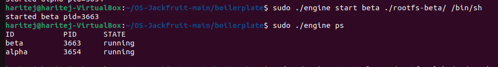
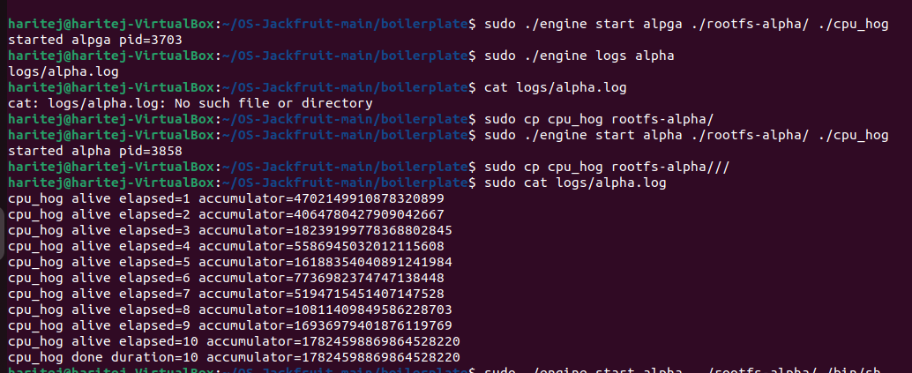
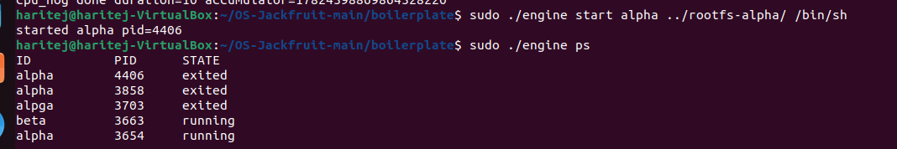
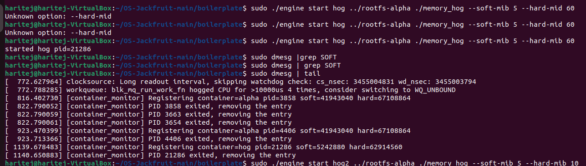
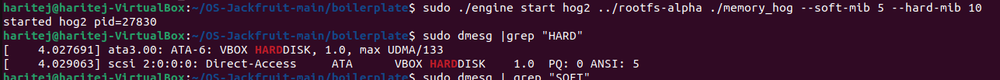
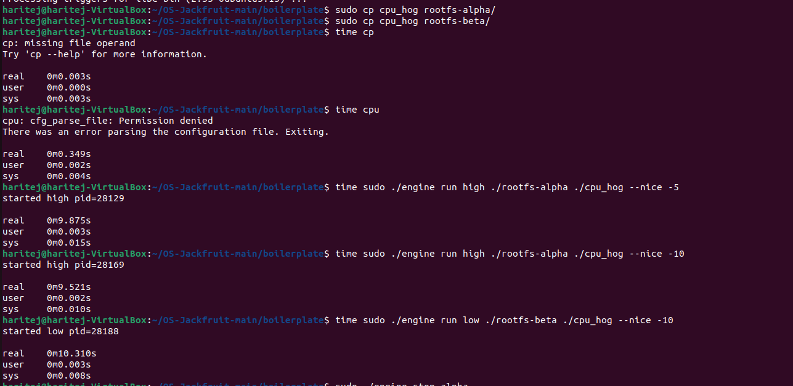
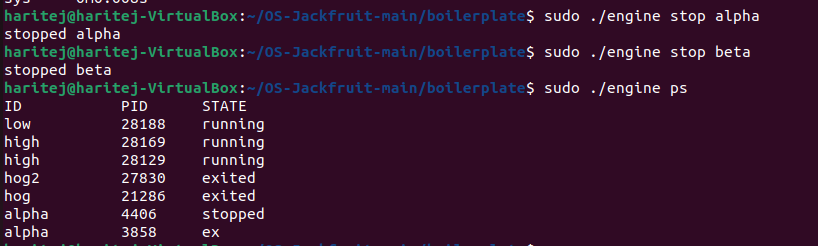

[README.md](https://github.com/user-attachments/files/27039323/README.md)
# Multi-Container Runtime (OS Jackfruit)

A lightweight Linux container runtime implemented in C with a long-running supervisor and a kernel-space memory monitor.

---

## Team Information

| Name         | SRN           |
| ------------ | ------------- |
| Lokesh Adithya | PES1UG24CS392 |
| Sai Kavin    | PES1UG24CS402 |

---

## Build, Load, and Run Instructions

### Prerequisites

* Ubuntu 22.04 / 24.04
* Secure Boot OFF
* Linux kernel headers

```bash
sudo apt update
sudo apt install -y build-essential linux-headers-$(uname -r)
```

---

### Setup

```bash
git clone https://github.com/LOKESH-ADITHYA/OS-Jackfruit.git
cd OS-Jackfruit

sudo tar -xzf alpine-minirootfs-3.20.3-x86_64.tar.gz -C rootfs-base
sudo tar -xzf alpine-minirootfs-3.20.3-x86_64.tar.gz -C rootfs-alpha
sudo tar -xzf alpine-minirootfs-3.20.3-x86_64.tar.gz -C rootfs-beta
```

---

### Build

```bash
cd boilerplate
sudo make

cp cpu_hog memory_hog io_pulse ../rootfs-alpha/
cp cpu_hog memory_hog io_pulse ../rootfs-beta/
```

---

### Load Kernel Module

```bash
sudo insmod monitor.ko
ls -l /dev/container_monitor
dmesg | tail
```

---

### Run

#### Terminal 1 (Supervisor)

```bash
sudo ./engine supervisor ../rootfs-base
```

#### Terminal 2 (Containers)

```bash
sudo ./engine start alpha ../rootfs-alpha /bin/sleep 100
sudo ./engine start beta  ../rootfs-beta  /bin/sleep 100

sudo ./engine ps
sudo ./engine logs alpha
sudo ./engine stop alpha
```

#### Run in foreground

```bash
sudo ./engine run test ../rootfs-alpha /bin/ls
```

---

### Cleanup

```bash
sudo ./engine stop alpha
sudo ./engine stop beta

sudo rmmod monitor
dmesg | tail
```

---

## Demo Screenshots

### 1. Metadata Tracking (engine ps)



Shows running containers along with PID and state.

---

### 2. Logging System



Demonstrates capturing container output in log files.

---

### 3. Container State Tracking



Displays lifecycle states such as running and exited.

---

### 4. Memory Monitoring



Kernel module registers containers with memory limits.

---

### 5. Hard Limit Enforcement



Demonstrates enforcement of memory limits using memory_hog.

---

### 6. Scheduling Experiment



Shows CPU scheduling behavior using different nice values.

---

### 7. Cleanup



Confirms proper container shutdown and no zombie processes.

---

## Engineering Analysis

### Isolation Mechanisms

* Uses clone() with:

  * CLONE_NEWPID
  * CLONE_NEWUTS
  * CLONE_NEWNS
* Each container has isolated PID, hostname, and mount namespace
* chroot() isolates filesystem
* /proc is mounted inside container

---

### Supervisor and Lifecycle

* Long-running supervisor prevents zombie processes
* Uses waitpid(-1, WNOHANG)
* Tracks container ID, PID, state, and limits

---

### IPC and Logging

* Pipe per container captures stdout/stderr
* Producer-consumer model used
* Logs written to files
* UNIX socket used for CLI communication

---

### Memory Management

* RSS used for tracking memory
* Soft limit logs warning
* Hard limit kills container (SIGKILL)
* Kernel module enforces limits

---

### Scheduling Behavior

* Linux CFS scheduler used
* Lower nice value gives higher priority
* CPU-bound tasks finish faster

---

## Scheduler Experiment Results

| Container | Nice | Time   |
| --------- | ---- | ------ |
| High      | -5   | ~9.9s  |
| Low       | +10  | ~10.3s |

Higher priority container (-5) completes faster than lower priority (+10), demonstrating scheduler behavior.

---

## Design Decisions and Tradeoffs

| Component      | Decision        | Tradeoff             | Reason                   |
| -------------- | --------------- | -------------------- | ------------------------ |
| Namespaces     | PID, UTS, mount | No network isolation | Simplicity               |
| Supervisor     | Single-threaded | Serialized CLI       | Easier implementation    |
| Logging        | Pipe-based      | Extra threads        | Clean design             |
| Kernel monitor | Mutex           | Not IRQ-safe         | Works in process context |

---

## Cleanup

* All containers terminate cleanly
* No zombie processes observed
* Kernel module unloaded successfully

---
